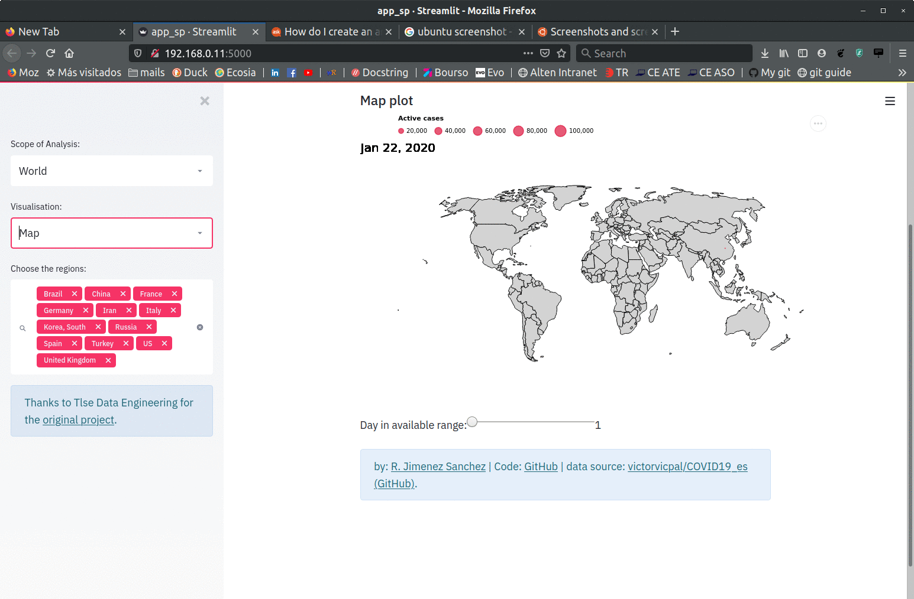

# DataViz App Covid-19
> A simple Data App built with [streamlit](https://www.streamlit.io/) to show the evolution of the Covid-19 epidemic in the World or in Spain. <br>
> All graphs shown on the App have been created with [Altair](https://altair-viz.github.io/). <br>
The App has been deployed in heroku and can be seen here: http://covid-app-spain.herokuapp.com/#



## Scripts
The main script is `app_sp.py`. It is used to add all streamlit interactive widgets and to call the appropriate functions. The script uses functions in `helpers.py` to load the data and in `my_alt_graphs.py` to create the graphs.

The files:
- requirements.txt
- Procfile
- setup.sh
are necessary for heroku.

## Data sources
* COVID-19 Data Repository by the Center for Systems Science and Engineering (CSSE) at Johns Hopkins University https://github.com/CSSEGISandData/COVID-19
* Spain COVID Data: datadista repository --> https://github.com/datadista/datasets
* Spain population by region (used also as data source for Spain COVID-19 data): https://github.com/victorvicpal/COVID19_es 
* Maps: https://github.com/deldersveld/topojson

## Setup

OS X & Linux:

```python
pip install -r requirements.txt
streamlit run app_sp.py
```
